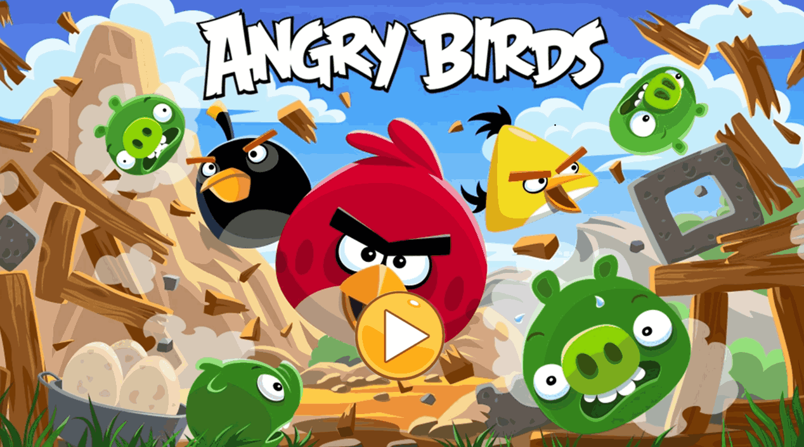
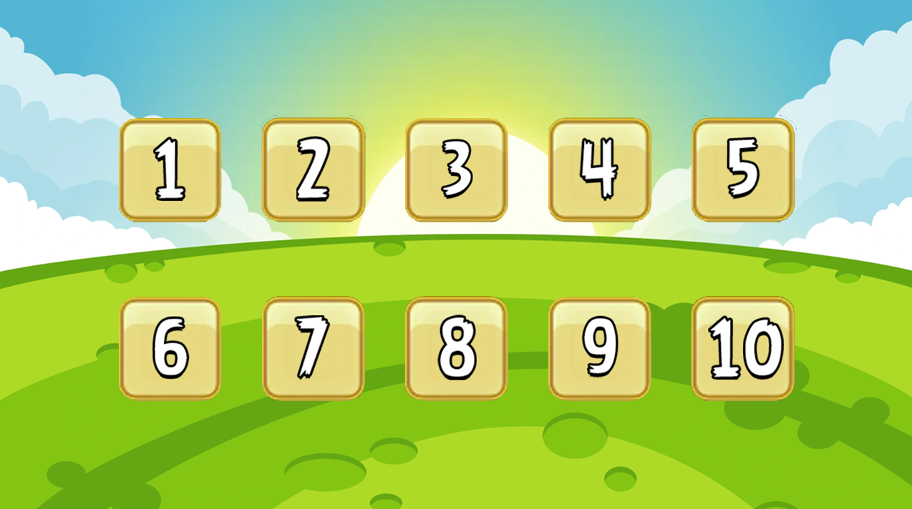
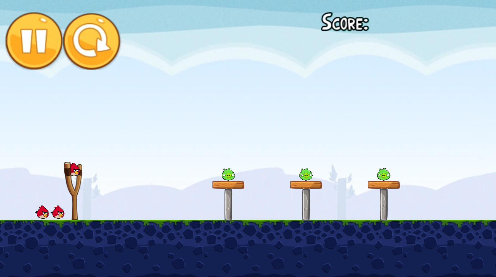
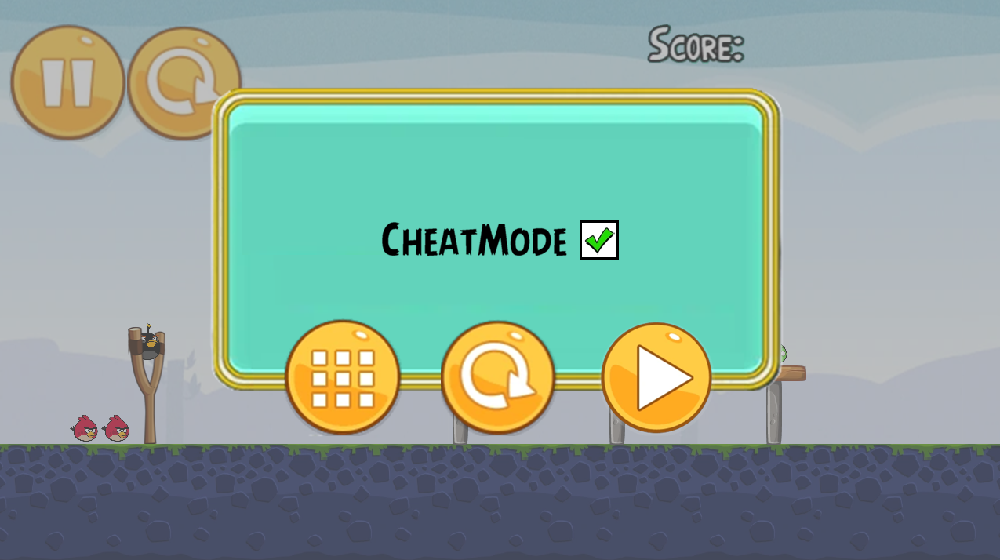
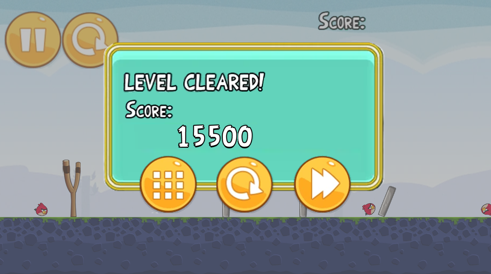
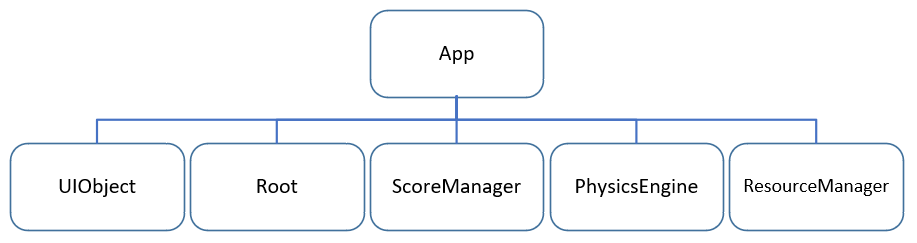
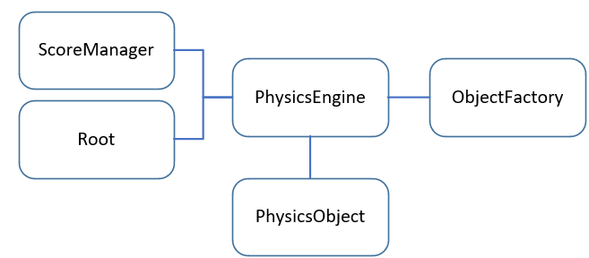
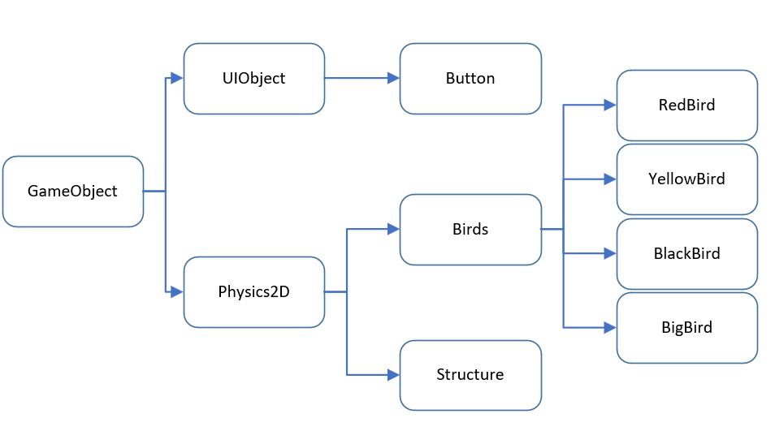

# 2025 OOPL Final Report

## 組別資訊

組別：第 48 組  
組員：洪俊瑋、李晨維  
復刻遊戲：Angry Birds

## 專案簡介

### 遊戲簡介

憤怒鳥 Angry Birds 是芬蘭 Rovio 娛樂推出的一款益智射擊遊戲。遊戲中玩家以一把彈弓，發射各種顏色的小鳥來打擊建築物和綠色的小豬，消滅關卡中所有的小豬就過關。因其有趣的遊戲內容、簡樸的風格和低廉的價格，屢獲讚賞。

### 組別分工

- 洪俊瑋：負責遊戲流程邏輯、物理引擎整合、得分與狀態管理、作弊模式開發
- 李晨維：負責 UI 設計、關卡設計

## 遊戲介紹

### 遊戲規則

- 玩家拖曳並釋放滑鼠，控制彈弓方向與力度來發射小鳥
- 小鳥將以拋物線飛行並與物件碰撞，破壞建築並攻擊豬
- 會死掉：如果玩家在使用所有小鳥後仍未能消滅所有豬，則關卡失敗。
- 會獲勝：成功消滅所有的豬即可過關。
- 有關卡：每個關卡都包含不同的地形、建築結構和敵人配置，並設有多種特殊效果的小鳥來協助玩家過關。

### 遊戲畫面

## 程式設計

### 程式架構

本遊戲以物件導向方式開發，主要模組包含：

- **應用程式核心 (App Class)**：
  - 管理遊戲主循環 (`Update`, `Start`)。
  - `PhaseManager()`：負責遊戲階段（主選單、關卡選擇、各個遊戲關卡）的切換與初始化。
  - `SetUpGame()`：初始化特定關卡的遊戲元素，如 UI 按鈕、彈弓、分數顯示，並創建物理引擎實例。
  - `SetUpMenu()`：初始化通用的彈出式選單（完成、失敗、暫停）。
  - `ExitLevel()`：清理當前關卡的資源，為切換到新狀態做準備。
- **遊戲物件 (GameObject & Derived Classes)**：
  - `Util::GameObject`：PTSD 基礎的遊戲物件類。
  - `Button`：可點擊的 UI 按鈕，處理用戶輸入。
  - `UIObject`：用於顯示靜態 UI 圖像（如背景、標題）。
  - `Slingshot`：彈弓物件，管理彈弓的視覺和發射邏輯。
  - `Physics2D` : 物理物件，保存物理世界資訊，所有參與物理的物件都應該屬於或繼承此類。
  - `Bird` : 鳥的基礎類別，帶有 pure virtual function `Ability`，各種鳥必須繼承這個類。
  - `Structure`: 繼承 `Physics2D`，額外保存材質跟形狀的資訊。
- **物理引擎介面 (PhysicsEngine - m_PE)**：
  - 封裝 Box2D 的功能。
  - `CreateBird()`：創建具有特定類型的小鳥。
  - `CreateStructure()`：創建具有特定材質、形狀和位置的建築方塊。
  - `CreatePig()`：創建具有特定類型的豬。
  - `SetUpWorld()`：初始化物理世界，準備模擬。
  - 處理碰撞偵測、物理計算。
- **分數管理 (ScoreManager - m_ScoreManager)**：
  - 負責計算、儲存和顯示玩家得分。
  - `ResetScore()`：重置分數。
  - `SetOffset()`：設定分數顯示位置。

模組之間透過成員變數（如 `m_PE`, `m_ScoreManager`）和函式呼叫進行互動，強調程式架構的模組化與維護性。

App 擁有一個 Renderer Root，一個 PhysicsEngine，一個 ScoreManager 實體，以及一個 ResourceManager 實體，並利用 vector 保存 UIObject 實體，通過控制這三者完成遊戲的進行。

PhysicsEngine 是遊戲的核心，負責物理模擬與碰撞檢測。它包含了物理世界的設定、物件的創建與管理，以及物理計算。

物件的繼承關係

### 程式技術

- C++ 物件導向設計（封裝、繼承、多型）
- PTSD 框架管理遊戲邏輯與圖形顯示
- Box2D 負責物理碰撞、重力、拋物線運動
- 自訂互動 UI 與流程控制
- 利用 `Cheat Mode` 加速開發與除錯

## 結語

### 問題與解決方法

- **物理模擬不穩**：Box2D 尺度限制，我們把物件的單位縮到 10 以內，優化物理表現
- **UI 顯示問題**：確認貼圖路徑與資源加載順序
- **C++ 與框架的學習曲線**：熟悉 PTSD 框架的使用方式以及 C++ 本身的特性（如記憶體管理、物件導向設計）是專案初期的主要挑戰。

### 自評

| 項次 | 項目                                     | 完成 |
| :--: | ---------------------------------------- | :--: |
|  1   | 完成指定關卡數量                         |  V   |
|  2   | 完成專案權限改為 public                  |  V   |
|  3   | 具有 debug mode 的功能                   |  V   |
|  4   | 解決專案上所有 Memory Leak 的問題        |  V   |
|  5   | 報告中沒有任何錯字，以及沒有任何一項遺漏 |  V   |
|  6   | 報告至少保持基本的美感，人類可讀         |  V   |

### 心得

### 貢獻比例

| 組員   | 貢獻內容與比例                                                 |
| ------ | -------------------------------------------------------------- |
| 洪俊瑋 | 遊戲流程邏輯、物理引擎整合、得分與狀態管理、作弊模式開發 (50%) |
| 李晨維 | UI 設計、關卡設計 (50%)                                        |
